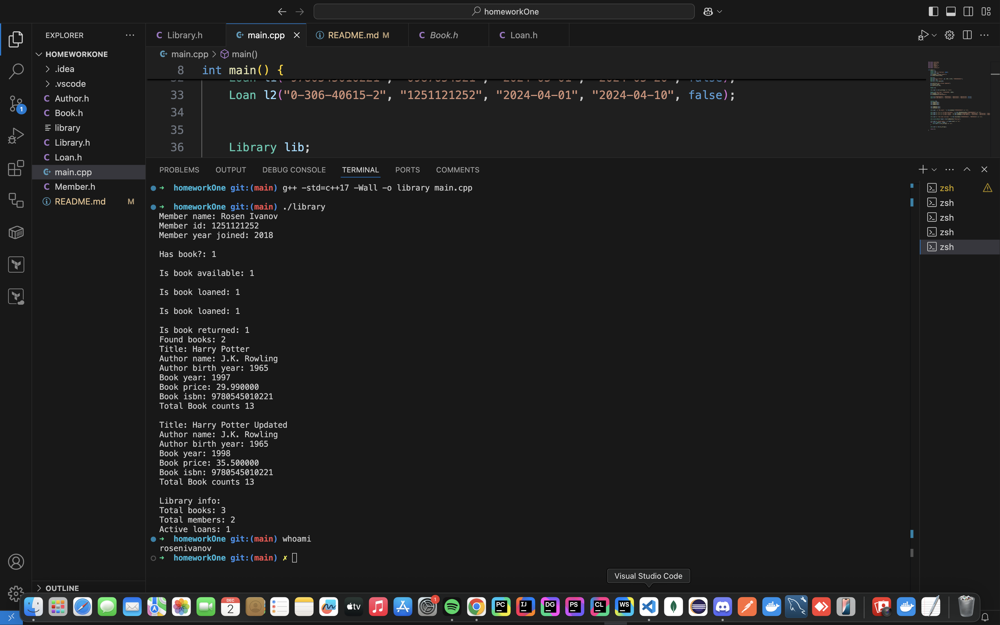

# Проект: Мини "Библиотечна система" (Library System)

## Описание

Проектът „Библиотечна система“ представлява малка C++ система, която моделира работа с книги, автори и членове на библиотека чрез пет взаимосвързани класа — `Author`, `Book`, `Member`, `Loan` и `Library`.
Целта е демонстриране на добри обектно-ориентирани практики, включително Rule of 3/5, константни методи, статични членове и валидиране на данни.

## Структура на проекта

```
homeworkOne/
├── Author.h
├── Book.h
├── Member.h
├── Loan.h
├── Library.h
├── README.md
├── main.cpp
└── main
```

## Компилация и изпълнение

Отворете терминал в директорията `homeworkLibrary/` и изпълнете:

```bash
g++ -std=c++17 -Wall -Wextra -O2 main.cpp -o library
```

След това стартирайте програмата:

```bash
./library
```

## Примерен изход

```
Member name: Rosen Ivanov
Member id: 1251121252
Member year joined: 2018

Has book?: 1

Is book available: 1

Is book loaned: 1

Is book loaned: 1

Is book returned: 1
Found books: 2
Title: Harry Potter
Author name: J.K. Rowling
Author birth year: 1965
Book year: 1997
Book price: 29.990000
Book isbn: 9780545010221
Total Book counts 13

Title: Harry Potter Updated
Author name: J.K. Rowling
Author birth year: 1965
Book year: 1998
Book price: 35.500000
Book isbn: 9780545010221
Total Book counts 13

Library info:
Total books: 3
Total members: 2
Active loans: 1
```

## Класове

### Author

Представя автор на книга.

**Членове:**

* `std::string name` — име
* `int birthYear` — година на раждане

**Методи:**

* `Author()` — конструктор по подразбиране
* `Author(std::string name, int birthYear)` — конструктор с параметри
* `setName()`, `getName()`
* `setBirthYear()`, `getBirthYear()`
* `to_string() const`

### Book

Представя книга.

**Членове:**

* `std::string title` — заглавие
* `Author author` — автор
* `int year` — година
* `double price` — цена
* `std::string isbn` — ISBN
* `static int totalBooks` — общ брой книги

**Методи:**

* `Book()`
* `Book(std::string title, const Author author, int year, double price, const std::string isbn)`
* `Book(const Book&)`, `Book(Book&&)` — Rule of 5
* `operator=`, `operator=(Book&&)`
* `~Book()`
* `setPrice()`, `getPrice()`
* `setYear()`, `getYear()`
* `getAuthor()`, `getTitle()`, `getISBN()`
* `to_string() const`
* `static int getTotalBooks()`

### Member

Представлява читател.

**Членове:**

* `std::string name` — име
* `std::string memberId` — уникален идентификатор
* `int yearJoined` — година на присъединяване

**Методи:**

* `Member()`
* `Member(std::string name, const std::string memberId, int yearJoined)`
* `setName()`, `getName()`
* `setMemberId()`, `getMemberId()`
* `setYearJoined()`, `getYearJoined()`
* `to_string() const`

### Loan

Представя заем на книга.

**Членове:**

* `std::string isbn`
* `std::string memberId`
* `std::string startDate`
* `std::string dueDate`
* `bool returned`

**Методи:**

* `Loan(std::string isbn, const std::string memberId, const std::string start, const std::string due, bool returned)`
* `markReturned()`
* `isOverdue(const std::string& today) const`
* `to_string() const`

### Library

Управлява книги, членове и заеми.

**Членове:**

* `std::vector<Book> books`
* `std::vector<Member> members`
* `std::vector<Loan> loans`

**Методи:**

* `addBook(const Book& b)`
* `addMember(const Member& m)`
* `hasBook(const std::string& isbn) const`
* `isBookAvailable(const std::string& isbn) const`
* `loanBook(const std::string& isbn, const std::string& memberId, const std::string& start, const std::string& due)`
* `returnBook(const std::string& isbn, const std::string& memberId)`
* `findByAuthor(const std::string& authorName) const`
* `to_string() const`

## Образователни цели

* Демонстриране на капсулация и const-коректност.
* Работа с конструктори, деструктори и статични членове.
* Прилагане на Rule of 3/5.
* Валидация на данни и поддържане на инварианти.

## Скрийншот на прилагане на практиките


## Автор

* Име: Росен Иванов
* Номер: 22324
* Курс: Обектно-ориентирано програмиране (C++)
* Дата: 02.12.2025
